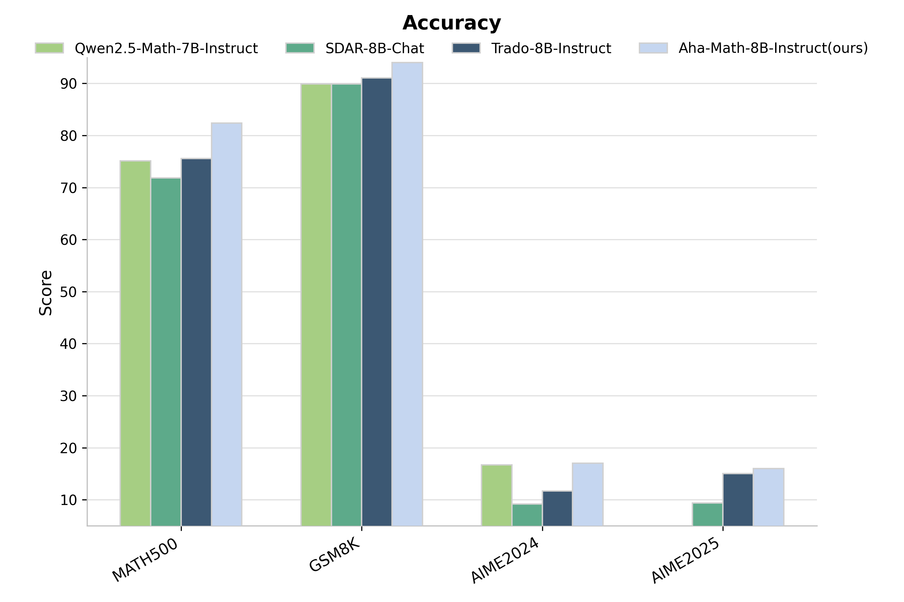

# GTPO-Trainer: An Efficient Training Framework for Diffusion Language Models

[Ying Zhu](#)<sup>1,2,3</sup>, [Jiaxin Wan](#)<sup>2</sup>, [Tianyi Liang](#)<sup>2,3</sup>, [Xu Guo](#)<sup>1,2</sup>, [Xiaoran Liu](#)<sup>1,2,3</sup>, [Zengfeng Huang](#)<sup>1,2</sup>, [Ziwei He](#)<sup>2,3,†</sup>, [Xipeng Qiu](#)<sup>1,2,3,†</sup>

<sup>1</sup>Fudan University, <sup>2</sup>Shanghai Innovation Institute, <sup>3</sup>OpenMoss Team

<sup>†</sup>Corresponding authors

[](https://arxiv.org/abs/YOUR_PAPER_ID)
[](https://arxiv.org/pdf/YOUR_PAPER_ID.pdf)
[](https://github.com/Auraithm/GTPO-Trainer)
[](https://huggingface.co/YOUR_MODEL_HERE)
[](LICENSE)




## TL;DR

We introduce **GTPO-Trainer**, an open-source training framework for Diffusion Language Models (DLLMs) with SFT and RL stages. Using this framework, we train **Aha-8B-Instruct**, achieving state-of-the-art results at the 8B scale on mathematical reasoning benchmarks, even outperforming 32B models on most tasks.


## HighLights

- **🎯 Novel RL Algorithm:** We propose **GTPO (Group Trajectory Policy Optimization)**, an RL algorithm that optimizes at the generation step level for DLLMs. It achieves unbiased implementation with complete consistency between optimization objectives and training process, and integrates dynamic sampling from DAPO during rollout to filter out low-quality data.
- **🚀 Efficient Training & Inference:** We support **Accelerate** framework for distributed training and **LMDeploy** inference engine for efficient rollout, while integrate **Speed Reward** mechanism to optimize inference speed at the training level, enabling both faster training and generation without sacrificing quality.
- **🧠 SOTA Performance:** We achieve state-of-the-art results at the 8B scale among both autoregressive (AR) models and diffusion language models (DLLMs) across multiple mathematical reasoning benchmarks. Specifically, we reach **83.05%** on MATH500, **20.63%** on AIME2024, and **20.83%** on AIME2025, surpassing all 8B baselines and even outperforming the 32B Qwen2.5-32B-Instruct model on AIME benchmarks.

## Method

We develop and release an open-source **diffusion post-training framework** for DLLMs, and train **Aha-8B-Instruct** based on **SDAR-8B-Chat** through two stages: *Supervised Fine-Tuning (SFT)* and *Reinforcement Learning (RL)*.

### Stage 1: Supervised Fine-Tuning (SFT)

We prepare a proprietary, high-quality mathematical dataset with **2K** samples and a generation length of **8K** tokens. We adopt a random-masking strategy to construct the training data for model fine-tuning.

### Stage 2: Reinforcement Learning (RL)

We design an RL algorithm -- **GTPO**, and train the model with a generation length of **8K**. We achieve an unbiased implementation of RL theory, ensuring complete consistency between the optimization objective and the actual training process. Additionally, during the rollout phase, we adopt dynamic sampling from DAPO to filter out data with zero advantage standard deviation.

Through this two-stage training pipeline, we successfully train **Aha-8B-Instruct**, a high-performance diffusion language model for mathematical reasoning.


## Performance

**Aha-8B-Instruct** achieves state-of-the-art results among DLLMs across mathematical reasoning benchmarks. Highlights include **83.05%** on MATH500 (surpassing the base model by **+11.20%**), **20.63%** on AIME2024 and **20.83%** on AIME2025 (dramatically outperforming all baselines), and **46.40%** on OlympiadBench. Our 8B model achieves performance comparable to or exceeding much larger 32B models on most benchmarks.

| Model | MATH500 | GSM8K | AIME2024 | AIME2025 | OlympiadBench | Average |
|-------|---------|-------|----------|----------|---------------|---------|
| Qwen2.5-7B-Instruct | 73.78 | 89.78 | 8.96 | 5.63 | 36.58 | 42.95 |
| Qwen2.5-32B-Instruct | 81.13 | **94.03** | 12.92 | 11.88 | **45.65** | 49.12 |
| SDAR-8B-Chat | 71.85 | 89.87 | 9.17 | 9.38 | 36.03 | 43.26 |
| Trado-8B-Instruct | 75.59 | 91.06 | 11.67 | 15.00 | 40.32 | 46.73 |
| **Aha-8B-Instruct (ours)** | **83.05** <br/><sub style="color: #28a745;">(+11.20)</sub> | **93.03** <br/><sub style="color: #28a745;">(+3.16)</sub> | **20.63** <br/><sub style="color: #28a745;">(+11.46)</sub> | **20.83** <br/><sub style="color: #28a745;">(+11.45)</sub> | **46.40** <br/><sub style="color: #28a745;">(+10.37)</sub> | **52.79** <br/><sub style="color: #28a745;">(+9.53)</sub> |


## Citation

If you find our work helpful, please consider citing:

```bibtex
@misc{zhu2025gtpo,
  title={GTPO-Trainer: An Efficient Training Framework for Diffusion Language Models},
  author={Ying Zhu and Jiaxin Wan and Tianyi Liang and Xu Guo and Xiaoran Liu and Zengfeng Huang and Ziwei He and Xipeng Qiu},
  year={2025},
  institution={Fudan University, Shanghai Innovation Institute},
  url={https://github.com/Auraithm/GTPO-Trainer}
}
```
